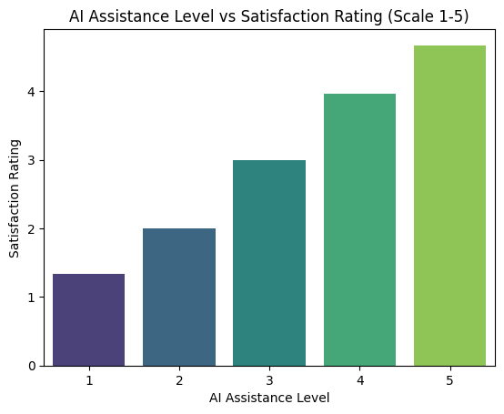
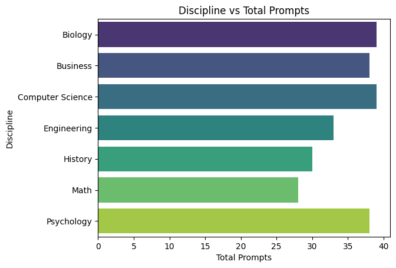
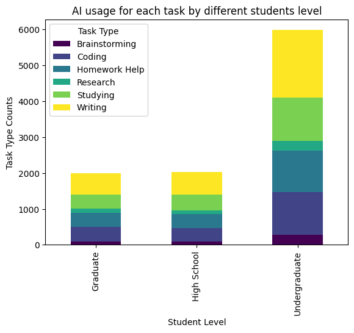

# 📊 AI Assistant Usage Analysis (Analysis 2)

## 📌 Overview  
This project analyzes how students from different levels and disciplines use an AI assistant. It explores patterns in **session length, task preferences, satisfaction, and AI usage trends**. The goal is to highlight **engagement behavior** and **task type popularity**.

---

## 📂 Dataset  
- **File**: `AI_assistant_usage.csv`  
- **Key Columns**:  
  - **StudentLevel** – High School, Undergraduate, Graduate  
  - **Discipline** – Subject (Computer Science, Psychology, Math, etc.)  
  - **SessionLengthMin** – AI usage time (minutes)  
  - **TotalPrompts** – Number of prompts sent  
  - **TaskType** – Type of task (Coding, Writing, Brainstorming, etc.)  
  - **AI_AssistanceLevel** – Intensity of AI involvement  
  - **FinalOutcome** – Whether the task was completed  
  - **SatisfactionRating** – User rating of AI experience  

---

## 📊 Analysis Performed  
- **Average Satisfaction by Student Level**  
- **Average Session Length by Discipline**  
- **Most Frequent Task Types for Each Student Level**  
- **Task Popularity Heatmap Across Levels**  

---

## 📊 Visualizations & Insights  

<table>
<tr>
<td align="center"><b>Satisfaction by Student Level</b></td>
<td align="center"><b>Session Length by Discipline</b></td>
</tr>
<tr>
<td></td>
<td></td>
</tr>
<tr>
<td align="center">Higher assistance levels (4–5) consistently yield higher satisfaction ratings.</td>
<td align="center">Brainstorming sessions tend to last longer than other tasks suggesting deeper engagement.</td>
</tr>
</table>

---

<table>
<tr>
<td align="center"><b>Task Type Distribution by Level</b></td>
<td align="center"><b>Task Preference Heatmap</b></td>
</tr>
<tr>
<td></td>
<td></td>
</tr>
<tr>
<td align="center">Computer Science, Psychology, and Biology disciplines show the highest average prompts.</td>
<td align="center">Undergraduates dominate AI usage across all task types, especially in Writing and Studying.</td>
</tr>
</table>

---
## 📌 Key Conclusions  

The analysis reveals several clear insights into AI assistant usage patterns:

* **AI Assistance Level** vs **Satisfaction** – Higher assistance levels (4–5) consistently yield higher satisfaction ratings, showing a **direct correlation** between guidance depth and user contentment.

* **Task Type vs Session Length** – **Brainstorming** sessions tend to last longer than other tasks, suggesting deeper engagement, whereas **Coding** and   **Writing** have moderately long sessions.

* **Discipline vs Total Prompts** – **Computer Science**, **Psychology**, and **Biology** disciplines show the highest average prompts, indicating heavier reliance on AI for academic support.

* **Student Level vs Task Usage** – **Undergraduates** dominate AI usage across all task types, especially in **Writing** and **Studying**, while **High School** and **Graduate** users show balanced but lower activity.

## 📜 Author  
👨‍💻 *Sahil Chakraborty*  
